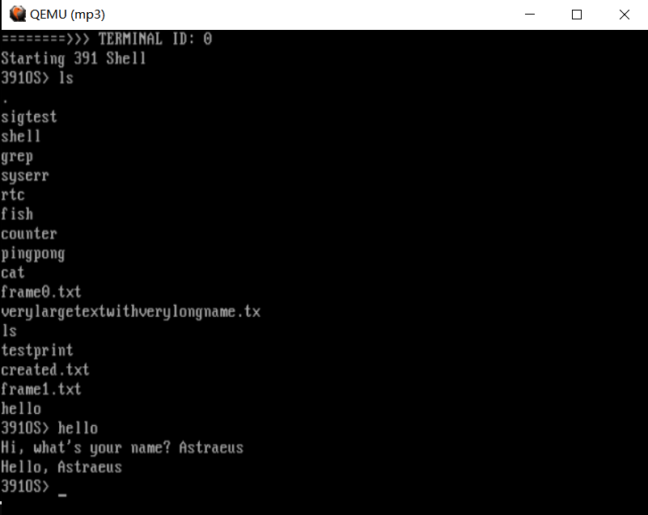
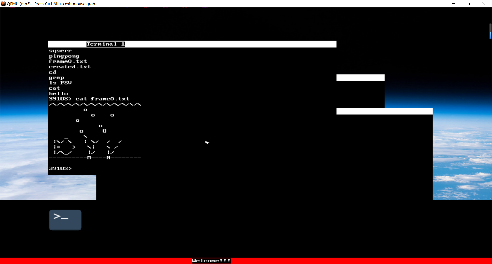

# MartianOS
## Introduction
This is a Linux-like Operating System Designed by our team of 4 **[LiuY, QiZT, SongYF and me]**. We used X86 to implement BOOT system, and built OS kernel in C. MartianOS has completed basic components in OS, except Networking. MatainOS includes Basic Memory Management, and Non-volatile File System (named PSV) on disk, etc.

## Terminal Version

## GUI Version
GUI is mainly developed by LiuY.

